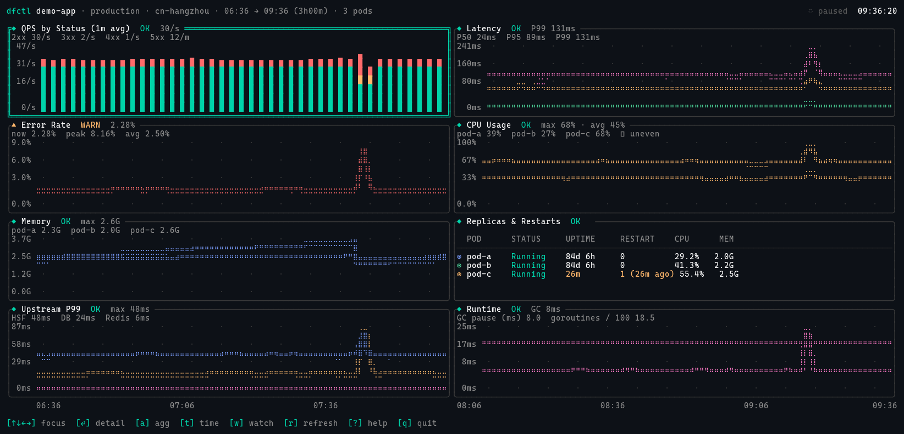
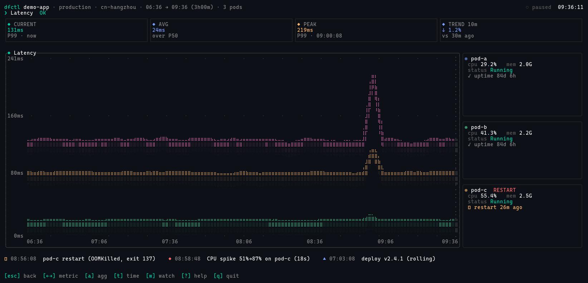
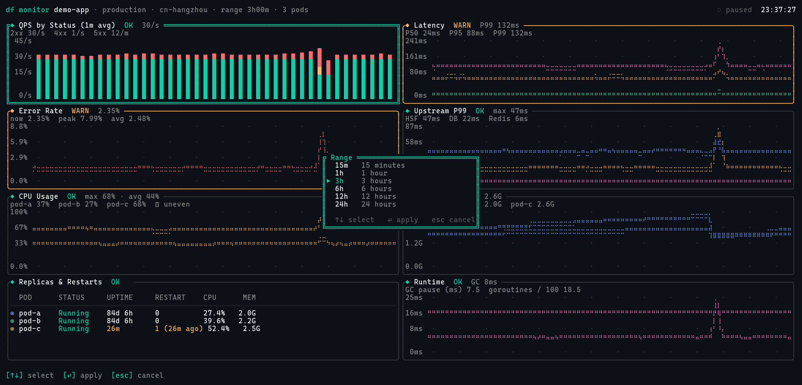
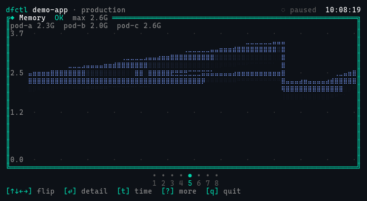
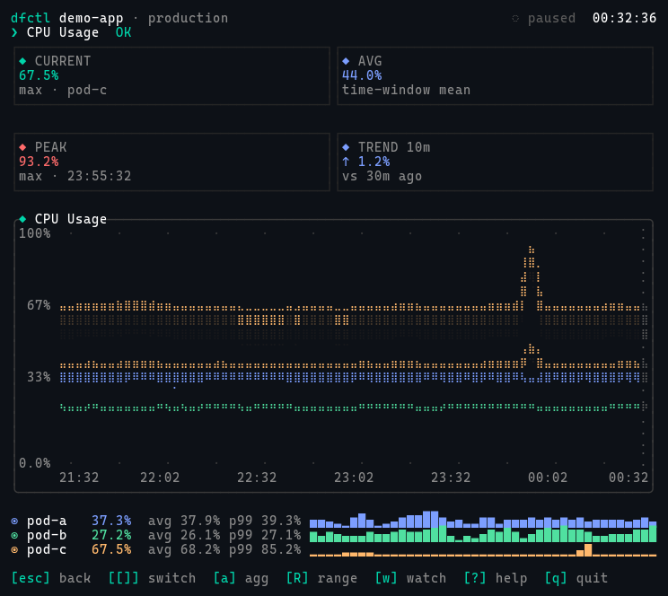

# dfctl-monitor

> **Application metrics in your terminal — `k9s` × `btop` for your service dashboards.**

`dfctl monitor <app>` is a Rust TUI for staring at production metrics during release‑watch, on‑call, or just because you've got a spare monitor and like seeing curves move. It's designed to feel like `btop` (rich Braille charts, soft glows, status badges) but speak the language of an *application* dashboard: QPS by status code, latency percentiles, per‑pod CPU/Memory, upstream dependencies, restart events.

It also speaks JSON so an AI agent can read what you're looking at.



📖 **Documentation**: <https://docs.dfctl.com/cli/monitor>

## Highlights

- **8 default panels, btop‑grade rendering** — Braille area charts with edge + glow, stacked bar QPS chart, percentile lines, replica table.
- **Single‑metric detail view** — KPI cards (CURRENT / AVG / PEAK / TREND), current‑value cursor, per‑pod sidebar with sparklines and stats, event row tying restarts/deploys/alerts to the chart.
- **Responsive layouts** — 2×4 grid on desktop, single‑column on narrow windows, **dedicated phone tier** (single panel per page, dot indicator, ↑↓ to flip) for SSH from your phone.
- **`watch` mode** — auto‑refresh with a live countdown in the header, pause/resume with space.
- **Aggregation switching** — `a` cycles each panel through max / avg / sum / p95 / per‑pod. Title reflects the mode.
- **Range picker** — `R` opens an overlay to flip between 15m / 1h / 3h / 6h / 12h / 24h.
- **JSON output** — `dfctl monitor <app> --json` writes structured data with `stats` (min/max/avg/p50/p95/p99) for upstream agents and scripts.
- **Truecolor palette** — proper accent / warn / alert colors, status‑colored panel borders, dimmed subtitles.

## Screenshots

| | |
|---|---|
| **Default overview** (2×4, 180×48) | **Single‑metric detail** (`dfctl monitor app --metric=cpu`) |
|  |  |
| **Range picker overlay** (`R`) | **Phone — single panel paging** (80×24) |
|  |  |
| **Phone — single‑metric** (80×40) | |
|  | |

## Install

You need a recent stable Rust toolchain.

```bash
git clone https://github.com/erchoc/dfctl-monitor.git
cd dfctl-monitor
cargo install --path .
```

The binary is called `dfctl` (with `monitor` as a subcommand) so you can extend it with more subcommands later without colliding with the system `df` (disk‑free).

> **Fonts.** Charts use Braille block characters (U+2800+). Use a Nerd Font with full Braille support — `JetBrainsMono Nerd Font`, `MesloLGS Nerd Font`, `FiraCode Nerd Font`, or `CascadiaCode Nerd Font` are all good. If you see box glyphs (口) instead of dots, your terminal font is the culprit.

## Usage

```bash
dfctl monitor                           # default app, 3h range, 2x4 overview
dfctl monitor my-service                # monitor a specific app
dfctl monitor my-service --watch        # 60s auto-refresh
dfctl monitor my-service --since=24h    # 24h history
dfctl monitor my-service --metric=cpu   # single-metric detail mode
dfctl monitor my-service --json         # dump metrics as JSON (no TUI)
dfctl monitor my-service --pod=pod-a,pod-b   # filter to specific pods
```

### Key bindings

| | |
|---|---|
| `↑↓←→` / `hjkl` | Move focus (phone: page through panels) |
| `Tab` / `Shift-Tab` | Cycle focus |
| `Enter` | Open detail view |
| `Esc` | Back to overview |
| `[` `]` | Previous / next metric (detail view) |
| `a` | Cycle aggregation (max → avg → sum → p95 → per‑pod) |
| `R` | Range picker overlay |
| `u` | Toggle traffic unit (RPM / QPS / auto) |
| `w` | Toggle watch mode |
| `space` | Pause / resume watch |
| `r` | Manual refresh |
| `?` | Help overlay |
| `q` / `Ctrl+C` | Quit |

## Configuration

`dfctl` looks for `~/.config/df/config.toml` (XDG‑aware):

```toml
[monitor]
default_range = "3h"
default_interval = "60s"

[monitor.endpoint]
url = "http://internal-monitor-api.example.com"

[monitor.aliases]
main = "demo-app-main-cluster"
```

App‑name aliases are resolved before any data lookup, so `dfctl monitor main` becomes `dfctl monitor demo-app-main-cluster`.

## Exit codes

| Code | Meaning |
|------|---------|
| 0 | Normal exit (`q` / Ctrl+C) |
| 1 | Generic error (network, JSON parse, etc.) |
| 2 | Terminal too small and not in `--json` mode |
| 3 | Application not found |
| 130 | SIGINT (Unix convention) |

## Data shape

The current build ships with a `MockDataSource` (100 ms simulated latency) so you can demo `dfctl monitor` without a backend. The data contract is:

```rust
struct MonitorResponse {
    app: String,
    region: String,
    env: String,
    time_range: TimeRange,
    resolution_seconds: u32,
    pods: Vec<PodInfo>,
    metrics: HashMap<MetricKind, MetricData>,
    events: Vec<Event>,
}
```

`MetricKind` covers `Qps`, `Latency`, `ErrorRate`, `Upstream`, `Cpu`, `Memory`, `Replicas`, `Runtime`. Each `MetricData` carries a `unit` and a list of `Series` (with `kind`, `aggregation`, `across_pods`, time/value points). The `--json` output adds per‑series `stats` (min/max/avg/p50/p95/p99) — handy for piping into `jq` or feeding an LLM.

## Roadmap

- [x] M1 JSON output
- [x] M2 Braille area chart primitive
- [x] M3 8‑panel overview
- [x] M4 Keyboard focus + navigation
- [x] M5 Desktop responsive (SingleColumn / TwoByFour / Large / Sidebar)
- [x] M5.5 Phone tier (single panel + dot indicator)
- [x] M6 Single‑metric detail view
- [x] M7 Watch mode (Mock backend; HTTP source pending)
- [x] M8 JSON output + config file + error handling
- [ ] HTTP backend (`HttpDataSource`)
- [ ] `p` / `m` / `/` overlay pickers (pod filter, metric filter, search)
- [ ] Snapshot tests with `insta`
- [ ] `--compare` historical comparison (yesterday / last week)

## Why "dfctl"?

`dfctl` is short for "df control" — i.e. tooling for the *df* (Dragonfly) platform. The binary intentionally avoids the system `df` (disk‑free) name. The repo is named `dfctl-monitor` because this is just the `monitor` subcommand; more `dfctl` subcommands may come later.

## Acknowledgements

Built on top of [ratatui](https://github.com/ratatui/ratatui), [crossterm](https://github.com/crossterm-rs/crossterm), [tokio](https://github.com/tokio-rs/tokio), [clap](https://github.com/clap-rs/clap), [serde](https://github.com/serde-rs/serde), and [chrono](https://github.com/chronotope/chrono). Design inspiration from `btop`, `k9s`, and Grafana.

## More

- 📖 Docs: <https://docs.dfctl.com/cli/monitor>
- 🐛 Issues: <https://github.com/erchoc/dfctl-monitor/issues>
- 🏗 Roadmap: see `Roadmap` section above
- 🤝 Contributing: PRs welcome — fork, branch, PR against `main`

## License

MIT.
